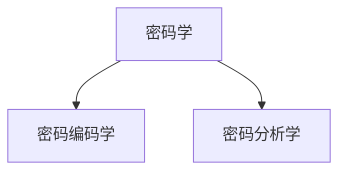
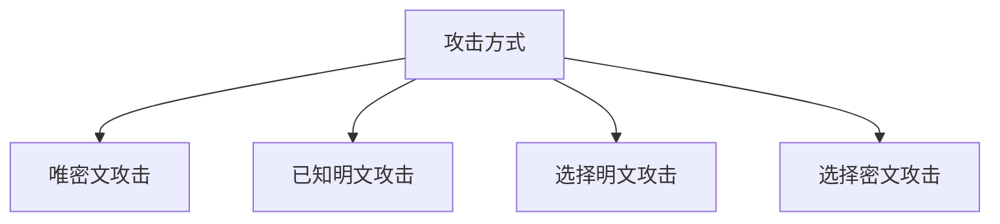
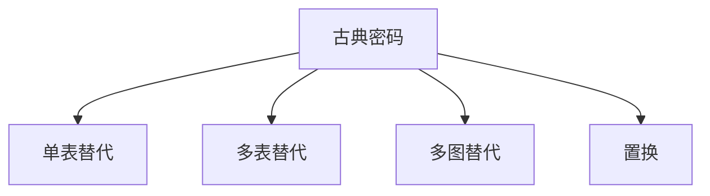
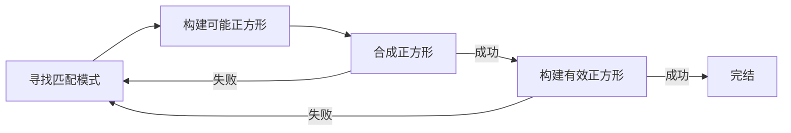
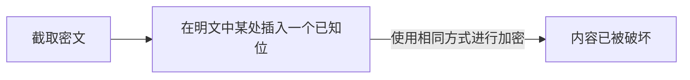
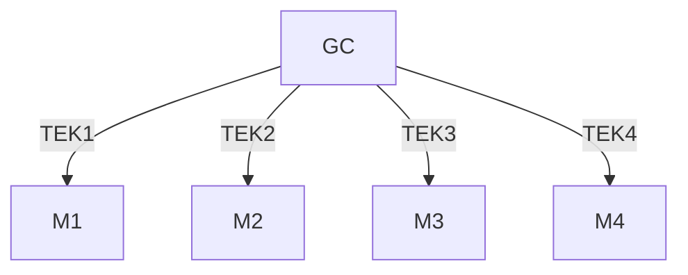

# 题型

单选10$\times$2；填空10$\times$1；判断10$\times$1；简答4$\times$5；计算（古典密码为主）4$\times$5；画图并解释 2$\times$10。

# 0、简介

密码学是信息安全的基础，是数学的一个分支。是对密码（cipher）和编码（code)的研究。密码学是构建和分析不同加解密方法的科学，包括加密和解密。

## 密码学划分



密码编码学是构建新的更强大，更有效的加解密方法的科学。

密码分析是发现现有方法中的弱点的科学，这样就可以在没有密钥的情况下恢复明文。

他们二者是对立统一的。

## 攻击方式



单密钥密码，私钥密码。加解密使用密钥相同

多密钥密码，公钥密码。加密和解密使用不同密钥

## 隐写术

隐写术是一种有助于将要隐藏的消息隐藏在其他消息中的技术，导致秘密消息本身被隐藏。**并不属于密码学**

其中，网格加密是隐写术常见的一种形式。相对容易破解。在战争中广泛使用。

# 1、古典密码

古典密码可以理解为不借助计算机便能实现的密码，大多数古典密码诞生于计算机普及之前。

所有的古典密码都是使用对称密钥，基于置换和替代两种方法实现。




## a)单表替代密码

​	单表替代密码每个明文字符都恰好被一个密文字符所替换。(一对一)

### caesar cipher

凯撒密码密钥为0~25，表示加密时将字母向右平移$key$个单位。（同理，解密时左移）

$ C \equiv\ P+K \mod(\mathit{26})\ $	$[a,z] \in [0,26] $  	

攻击方式：穷举（26种可能）

### keyword cipher

关键字密码密钥为一个字符串，加密时先将关键字去重，然后先填充去重后的关键字再从a开始填充剩余字符产生对照表，按照对照表将每一字符进行加密:

e.g. 关键字为:successful  去重后：sucesfl

| 明文 |  a   |  b   |  c   |  d   |  e   |  f   |  g   |  h   |  i   |  j   |  k   |  …   |  x   |  y   |  z   |
| :--: | :--: | :--: | :--: | :--: | :--: | :--: | :--: | :--: | :--: | :--: | :--: | :--: | :--: | :--: | :--: |
| 密文 |  s   |  u   |  c   |  e   |  s   |  f   |  l   |  a   |  b   |  d   |  g   |  …   |  x   |  y   |  z   |

攻击方式：频率分析，以英文中字母出现的频率作对照，密文中字母出现频率来推其对应的明文

### multiliteral cipher

选取五个不同的字母作为关键字，然后生成对照表，用对照表里的字符来替代明文： 其中j被认定为i

e.g.:  keyword：later

|       |  L   |  A   |  T   |  E   |  R   |
| :---: | :--: | :--: | :--: | :--: | :--: |
| **L** |  a   |  b   |  c   |  d   |  e   |
| **A** |  f   |  g   |  h   |  i   |  k   |
| **T** |  l   |  m   |  n   |  o   |  p   |
| **E** |  q   |  r   |  s   |  t   |  u   |
| **R** |  v   |  w   |  x   |  y   |  z   |

a:LL,b:LA,c:LT$\cdots$z:RR

缺点：密文中只有五个字符，可被穷举推测出关键字的顺序。

## b)多表替代密码

每个明文被多个密文所替代、每个密文可替代多个明文（一对多、多对一）

### vigenere cipher

选取一个关键词作为密钥，循环使用来加密。

$C \equiv\ P + K\mod(\mathit{26}) $ 									其中 $ 字符[a,z] \in[0,25]$

破解：密钥中重复的部分与明文中重复部分相结合会产生密文中的重复，可在密文中寻找重复的部分来确定密钥长度，每隔密钥长度个字符取字符构成单表替代，依据频率分析来确定密钥。

### autokey cipher

vigenere cipher的改进版，用每次加密后的密文作为密钥来将明文进行加密（参照vigenere表），如此循环下去。

缺点：将整个密文作为密钥进行解密可以确定出除了前几位（与密钥长度相同）外，剩下的所有明文。

改进：将每次加密所对应的明文作为密钥进行加密。

### rotor cipher

轮盘形式（物理实现，内部的导线确定了单字符替换的方式）。每个明文按设定对应某个密文，将明文输入进轮盘中然后输出对应的密文。

将多个轮子连接且以不同的速度旋转实现多维的加密。

应用：**enigma**

#### enigma

由1个plugboard+3个rotor+1个reflector组成。明文先通过plugboard然后进行三个不同rotor的加密后进入reflector进行反射，反射后的结果再按路径返回得到密文。

## c)多图替代密码

无论是单表替代和多表替代密码，每次仅能处理一个明文。多图替代密码一次可处理多个密文。*例如*：每两个字符看作一组进行加密，理论上每组有26^2^种不同的加密可能。

### playfair cipher

目的：打破频率分析。

实现：关键字去重之后且去除j之后，构造一个$5\times5$的字母矩阵。先填入去重后的关键字再剩余字母（***按顺序***）。

e.g. ：   keyword：harpsichord  去重后：harpsicod

|   H   |   A   |   R   |   P   |   S   |
| :---: | :---: | :---: | :---: | :---: |
| **I** | **C** | **O** | **D** | **B** |
| **E** | **F** | **G** | **K** | **L** |
| **M** | **N** | **Q** | **T** | **U** |
| **V** | **W** | **X** | **Y** | **Z** |

每两个明文（m~1~,m~2~）构成一组，按照相应规则进行替换。

**替换规则：**

1. 两字符同行，则分别被其右侧字符所替代。
2. 两字符同列，则分别被其下方字符所替代。
3. 不同行且不同列，则将两字符视为对角线，构造矩形，分别被同行的对角线位置的字符替代。
4. 如若连续的两字符重复，则在中间插入占位符再替换。
5. 如若非偶数，则在末尾添加占位符进行替换。
6. 占位符为不常用字符（q、z……）

**缺点：**

1. 明文中字符$m_1$不能被$m_1$所替代
2. 不会出现（m,m）
3. 若（m~1~,m~2~)$\to$(a~1~,a~2~)则（m~2~,m~1~)$\to$(a~2~,a~1~)
4. 每个字符仅有五种替换结果（同行或下方）

攻击： （**已知明文攻击**）

用已知的一段明文来逐一对应密文，开始先检测是否违背上述规则，然后再进行构建。



### double playfair

用两个关键字来构建两个$5\times5$矩阵来进行替换。（左右并排构成$5\times10$矩阵）

替换规则：

1. 同行被右侧字符所替。
2. 非同行被对角线所替代。
3. 每个字符均被另一个矩阵中的字符所替代。
4. 替代两次。

优点**（相较于playfair）**：

- 明文中可以出现（m,m）
- 每组中的两个字符交换位置替代结果无规律
- 密文中可以连续出现两个相同字符

## d)置换密码

### skytale cipher

将羊皮纸缠绕在特定形状、大小的木棍上，然后每面从上到下书写。展开后顺序扰乱，只有按原方式缠绕后才能破解。**（斯巴达人）**

### permutation cipher

将明文进行分组，每组固定长度$d$，给定去重后长度为$d$的关键字作为密钥。记录去重后的密钥中各字符在遍历字母表时出现的次序。然后将每组中的几个字符放在对应位置。

e.g. 

|     明文     | 密钥  |
| :----------: | :---: |
| get the ball | cdaeb |

密钥顺序：（3,4,1,5,2） 

|          | 第一组 | 第二组 |
| :------: | :----: | :----: |
| **明文** | getth  | eball  |
| **密文** | thget  | alebl  |

### column permutation cipher

将明文进行分组，每组固定长度$d$，构建$m\times d$大小的矩阵，然后给定一关键词（去重后长度为$d$）以关键字中各字符在遍历字母表时出现的次序来确定列提取的优先级。

e.g.:

|         明文          | 密钥 |
| :-------------------: | :--: |
| encryption algorithms | cbda |

列提取顺序：4-2-1-3

构表：

|  1   |  2   |  3   |  4   |
| :--: | :--: | :--: | :--: |
|  e   |  n   |  c   |  r   |
|  y   |  p   |  t   |  i   |
|  o   |  n   |  a   |  l   |
|  g   |  o   |  r   |  i   |
|  t   |  h   |  m   |  s   |

密文：rilisnpnoheyogtctarm

### double column permutation cipher

选取两个不同的关键字，将第一次加密后的结果按行填充进矩阵再进行第二次的加密。

## 2、流密码

由于计算机中是二进制存储的，选取与明文的ASCII码等长的密钥进行逐位异或操作产生密文。**但存在着相关的问题**：短序列的密钥容易记住但不安全，较长的密钥安全但是记不住。于是产生了随机数。

TRNG（true random number generator）真随机数，通常来自计算机的物理环境。

PRNG（pseudorandom random number generator）伪随机数，将一个固定值（随机种子）作为输入，并使用确定性的算法生成一系列的输出位。

最常见的破解流密码的方式是使用插入攻击以及可能单词的搜素。

插入攻击



可能单词攻击：猜测某一个单词是什么，然后使用此信息查找密钥流。

### shift register

移位寄存器。它进行一种保存位并移位的操作。

liner feedback shift register）（LFSR)

线性反馈寄存器，将寄存器中的某两个进行异或，结果作为新的输入。

### RC4

由于它的高效以及可以轻松的在软件和硬件中实现，因此它较为广泛的使用：

- SSL、TLS（Internet中https协议的s）
- WPA、WPA2、WPA3（WiFi）
- BitTorrent协议加密

RC4使用数字0~255（8bit长度）的数组S进行排列。包括KSA和PRGA两个部分

#### KSA：

用于设置数组初始排列的密钥调度算法:

$S(i)=i$          $i\in(0,255)$

```
for(i=0;i<256;i++)
    {
    j=(j+S(i)+K(i))%256
    swap(S(i),S(j))
    }
```

#### PRGA:

一旦KSA完成对S的初始随机化，PRGA将接管并通过选择S的随机元素并修改S进行下一次选择来选择密钥流的字节。

选择过程依赖于两个索引i和j，它们均始于 0 

运行以下程序以选择密钥流的每个字节：

```
    i=(i+1)%256
    j=(j+S(i))%256
    swap(S(i),S(j))
    t=S(i)+S(j)
    K=S(t)
```

RC4的缺点是密钥计划不足。

### CA

CA是简单单元的一维or二维数组。

一维：

选取rule（数字）改写成二进制对可能情况进行赋值

e.g: rule=23(00010111)

规则编号

|      | 000  | 001  | 010  | 011  | 100  | 101  | 110  | 111  |
| ---- | ---- | ---- | ---- | ---- | ---- | ---- | ---- | ---- |
| rule | 0    | 0    | 0    | 1    | 0    | 1    | 1    | 1    |

7cell例子：

| 1    | 2    | 3    | 4    | 5    | 6    | 7    |
| ---- | ---- | ---- | ---- | ---- | ---- | ---- |
| 0    | 1    | 0    | 1    | 0    | 1    | 1    |

每个单元和其左右按照左中右的顺序排列： 

| 1    | 2    | 3    | 4    | 5    | 6    | 7    |
| ---- | ---- | ---- | ---- | ---- | ---- | ---- |
| 101  | 010  | 101  | 010  | 101  | 011  | 110  |

参照对照表，得出相应的结果。

二维：（**2DCA**）

2DCA分为两种：von neumann （冯·诺依曼）  和 moore（摩尔）

von neumann neighborhood 选取上下左右四方位。

s’~i,j~=X $\bigotimes$ (C$\times$s~i,j~)$\bigotimes$(N$\times$s~i-1,j~)$\bigotimes$(W$\times$s~i,j-1~)$\bigotimes$(E$\times$s~i,j+1~)$\bigotimes$(S$\times$s~i+1,j~)

其中(X,C,N,S,W,E)由rule二进制形式确定。

e.g. :

rule 14(001110)	(X,C,N,S,W,E)=（0,0,1,1,1,0）

摩尔方法八方位亦同。

## 3、分组密码

分组密码使用范围最为广泛。

### DES

太复杂，省略。

SDES：（DES简化版）

8bit明文，只进行两次置换。

10bit密钥。 

循环左移：第$i$次左移$i$位

PC-1：

| 3    | 5    | 2    | 7    | 4    | 10   | 1    | 9    | 8    | 6    |
| ---- | ---- | ---- | ---- | ---- | ---- | ---- | ---- | ---- | ---- |

PC-2：

| 6    | 3    | 7    | 4    | 8    | 5    | 10   | 9    |
| ---- | ---- | ---- | ---- | ---- | ---- | ---- | ---- |

IP：

| 2    | 6    | 3    | 1    | 4    | 8    | 5    | 7    |
| ---- | ---- | ---- | ---- | ---- | ---- | ---- | ---- |

IP-1：

| 4    | 1    | 3    | 5    | 7    | 2    | 8    | 6    |
| ---- | ---- | ---- | ---- | ---- | ---- | ---- | ---- |

EBOX：

| 4    | 1    | 2    | 3    | 2    | 3    | 4    | 1    |
| ---- | ---- | ---- | ---- | ---- | ---- | ---- | ---- |

PBOX：

| 2    | 4    | 3    | 1    |
| ---- | ---- | ---- | ---- |

SBOX1：（第一列表示行，第一行表示列）

|       | 0    | 1    | 2    | 3    |
| ----- | ---- | ---- | ---- | ---- |
| **0** | 1    | 0    | 2    | 3    |
| **1** | 3    | 1    | 0    | 2    |
| **2** | 2    | 0    | 3    | 1    |
| **3** | 1    | 3    | 2    | 0    |

SBOX2：（同上）

|       | 0    | 1    | 2    | 3    |
| ----- | ---- | ---- | ---- | ---- |
| **0** | 0    | 3    | 1    | 2    |
| **1** | 3    | 2    | 0    | 1    |
| **2** | 1    | 0    | 3    | 2    |
| **3** | 2    | 1    | 3    | 0    |

DES存在一些弱密钥：0101010101010101、FEFEFEFEFEFEFEFE、1F1F1F1F0E0E0E0E、0E0E0E0E1F1F1F1F。

### AES:

Rijndael在NIST的选取中获胜：

可变块长度：128bit、192bit、256bit。

可变密钥长度：128bit、192bit、256bit。

N~k~$=$$\frac{密钥长度}{32}$,N~b~$=$$\frac{明文长度}{32}$。加密轮次$=max(N_b,N_k)+6$

Initial Step：先将明文按字节（Bytes）分组。128bit构建$4\times4$数组，更长则添加列。密钥也进行相同操作。

Substitution：替换表使用的是单个BOX，为$16\times16$矩阵。将数组中某一位置的八位（1Bytes）先四位对应行、后四位对应列。取出对应数字来替换原位置。

Shift Row Operation：

对S-BOX输出的结果进行操作，第$i$行左移$i$位。 $i \in[0,3] $

Matrix Multiply：

取一列（4Bytes）坐乘变换矩阵。然后进行异或。

变换矩阵：

$T=\begin{Bmatrix} 02 & 03 & 01 & 01 \\ 01 & 02 & 03 &01\\01&01&02&03\\03 &01&01&02 \end{Bmatrix}$

e.g. 某一列：A~i,1~={C9,6E,46,A6}^T^ 

运算过程中依据矩阵运算，但乘法采用位运算（mod 2^8^）。加法则为异或。

a‘~（1,1）~$=$（02·C9）$\bigotimes$（03·6E）$\bigotimes$（01·46）$\bigotimes$（01·A6）

02·C9(11001001)=10010010（左移一位）

01·a~i,j~$=$a~i,j~	02·a~i,j~$=$a~i,j~$\times$2$\mod(2^8)$	03·a~i,j~$=$(01$\bigotimes$02)·a~i,j~$=$（01·a~i,j~）$\bigotimes$（02·a~i,j~）

Key Add：

经Matrix Multiply变化后的矩阵与密钥矩阵进行异或。

AES决赛作品中其他优秀加密方案：

IDEA： 128bit 密钥，8轮加密。中国、朱学嘉。

RC6： 128、192、256bit密钥，20轮加密。Rivest、Robshaw、Sidney、Yin

Twofish： 128、192、256bit密钥，16轮加密。

对比

|         | keylen | speed | security |
| :-----: | :----: | :---: | :------: |
|   DES   |   56   |  中   |    弱    |
|  IDEA   |  128   |  慢   |    中    |
|   RC6   |  变长  | 不定  |    高    |
| Twofish |  变长  | 不定  |    中    |
|   AES   |  变长  | 不定  |    高    |

## 4、公钥密码

之前的所有密码都涉及到一个密钥分配的问题，密钥分配成为密码中的弱点。公钥密码也称非对称密钥密码。公钥和私钥通常是基于数论而非常规的替代或置换。

公钥密码的要求：

- 易于产生公钥和私钥
- 易于加解密
- 难以从公钥计算私钥
- 难以从密文和公钥中计算明文

### RSA

由Rivest、SHamir、Adleman三人发明（首字母简称：RSA)

旨在解决密钥传输的安全性问题，常用于加解密和数字签名。

基于大素数分解难问题。（虽然没有证据表明这个问题很棘手，但仍然没有找到一个较好的方法）

原理：

- 选择两个100+bit的素数$p,q$  （位数差别很大）。	$n=pq$  	$\phi(n)=(p-1)(q-1)$
- 随机选取正整数$d$， $1<d<\phi(n)$且$gcd（d,\phi(n)）=1$
- 计算$e$,满足$de\equiv1\mod(\phi(n))$ ,即 d^-1^=e。（e是d关于$\phi(n)$的乘法逆元）
- n和e公开。**p、q、$\phi(n)、d$**非公开
- 公钥和私钥为$(e,n)$、$(d,n)$
- 加密：对明文m（1<m<n）有：$c\equiv m^e \mod(n)$
- 解密：对密文c， $m\equiv c^d \mod(n)$
- RSA一次加密$k$位，其中k=[log~2~n]。

### ELGAMAL

常用于加解密和数字签名

基于离散对数问题。

- 选择一个大素数p

- 获取一个循环群G~p~，小于p-1的随机整数a，生成数g。

- $b=g^a \mod(p)$,公钥为$（p,g,b)$,私钥为$a$

  加密：

- 发送方首先要查找公钥$（p,g,b)$,并表示为整数$m$,其中$1<m<p-1$

- 选择一个随机密钥k$1<k<p-1$

- $c_1\equiv g^k \mod(p)$			$c_2=m \times b^k \mod(p)$

- 发送$(c_1,c_2)$

  解密：

- $m\equiv c_2\times c_1$^-a^$ \mod(p)$​

- 证明$c_2\times c_1$^-a^$\equiv $mb^k^(g^k^)^-a^$\equiv$m(g^a^)^k^(g^-a^)^k^$\equiv m \mod(p)$

### ECC cipher

​	基于椭圆曲线方程$y^2 \equiv x^3 + ax + b \mod(p)$

​	椭圆曲线方程是关于$x$轴对称的。

​	P+Q：点P与点Q连线与曲线的交点为-（P+Q），关于$x$轴对称一下得P+Q

- 给定两个点P、W。其中$W=kP$求$k$

- 公钥为G和P~A~，其中P~A~=kG
- 通过将明文转换为数字m，选择随机数r，并在曲线P~m~上找到$x$和$y$坐标之差等于$m$的点，对消息进行加密。
- 密文由曲线上两个点组成,C={rG,P~m~+rP~A~}
- P~m~$+$rP~A~$-$k(rG)=P~m~

### knapsack cipher

背包密码，基于0-1背包问题，是NP难问题。

(也被称为子集合问题)

$b_i=0 or 1$,使得$S=b_1m_1+b_2m_2+ \cdots +b_nm_n$

e.g.：对于背包（5,14,9,23,16,7,31,27）给定$a$(ASCII码为01100001)			$S=0*5+1*14+\cdots+27*1=50$

简单背包问题：超增数列（每一个大于前面数之和）从最大往最小来分解。

trapdoor knamsack：

- 给定一个超增的背包序列A={$a_1,a_2,\cdots,a_n$}
- 选定一个整数u,u>2a~n~
- 选择另一个整数$w$,gcd(w,u)=1
- A’=$wA \mod(u)$
- 寻找w关于u的乘法逆元w^-1^
- 私钥为A、w^-1^、u

加密：

明文P=（$p_1p_2\cdots p_n$）,trapdoorB=（$b_1b_2\cdots b_n$）,C=$b_1p_1+b_2p_2+ \cdots + b_np_n$

解密：P’$\equiv $w^-1^C$\mod(u) \equiv$w^-1^($b_1p_1+b_2p_2+\cdots +b_np_n \mod(u)$)$\equiv a_1p_1+a_2p_2+\cdots+a_np_n$

## 5、密钥管理

密钥管理是支持在授权之间建立和维护密钥关系的一组技术和程序。

包括：密钥生成、密钥存储和恢复、密钥分布

生成：抛硬币、掷骰子。

托管：允许第三方在必要时访问。

保障安全：将密钥委托给多个第三方，每个第三方只有密钥的一部分。

由于公钥算法往往比较慢，因此它们通常用于安全地传输密钥以获取更快的分组密码。但是，除了公钥系统以外，还有其他协议可用于协商通用的分组密钥。密钥交换不仅包括对交换，而且还涉及组交换。

一种著名的配对密钥交换方法称为Diffie-Hellman密钥交换系统

### Diffie-Hellman

- 选择大素数$p$和随机数$g$（均公开）

- Alice选择秘密随机数$a$, 将	$g^a \mod(p)$	发送给Bob

- Bob选择秘密随机数$b$,将  $g^b \mod(p)$发送给Alice

- Alice计算$（g^b \mod(p))^a \mod(p)=k_1$

- Bob计算$(g^a \mod(p))^b \mod(p)=k_2$

- 他们最终都使用相同的数字（k~1~=k~2~），这是通用密钥
- Alice和Bob彼此不共享秘密随机数，均不知道最终的密钥是什么。
- 安全性在于：要想破解密钥，需要同时解出a和b，而这是离散对数问题。

该过程也可以不依赖于指数，亦可以使用ECC方案：

- ​	选择合适的曲线G,然后选择基点P
- Alice和Bob各选一个随机数A,B
- Alice将P~A~=AP发送给Bob
- Bob将P~B~=BP发送给Alice

最终的ECC密钥为K=ABP

### group key

DH对于成对的用户来说效果很好，但是也需要大量用户同时安全地建立密钥。

有时，当一个用户企图向多个用户发送消息或多个用户之间进行安全讨论时，每个发送方都是接收方，该过程成为对等组通信

#### DH模式

仿照Diffie-Hellman方法进行多次发送。

弊端:当有人想加入（或离开）该组时，必须再次从头开始执行相应步骤。灵活性不够。

#### Star模式

一个广播中心和多个TEK（流量加密密钥）多个KEK（密钥加密密钥）

通过KEK发送TEK



广播加密：信号通过加密传输，只有拥有密钥的付款人子集才能解密信号并观看节目。必须要解决的问题是如何分配密钥。（二叉树形式表示）

## 6、认证

信息安全的目标（CIARA）：Confidentiality、Integrity、Availability、Reliability、Accountability

使用DH或某种密钥交换协议的变体，Alice和Bob可以确定他们共享一个秘密密钥。为了明确信息是否被篡改、发信人是否正确，提出了包括信息真实性、身份真实性在内的真实性技术。主要技术包括：报文摘要、数字签名、证书、PKI

### MAC

Message Authentication Code（消息身份验证码）

- 由算法生成固定大小的小块
- 依赖于消息和密钥
- 类似于加密，但不一定可逆。
- 附加到邮件中作为签名
- 接收方对消息实行相同的计算并检查其是否与MAC相匹配。
- 提供确保消息不变且来自发件人的保证
- 依赖于Message Digest，是从消息中得出的结论。具有固定的长度并且可以反映消息的特性

### HF

Hash Function（哈希函数）

- 将任意消息压缩为固定大小 $h=H(M)$

- 通常假设哈希函数是共有的，并且没有键入
- 哈希用于检测消息更改
- 可以以各种方式与消息使用，最常用于创建数字签名

细节：

- 可以用于任何大小的消息M，生成可变长度的输出h

- 对一些消息M，容易计算出 $h=H(M)$

- 给定的$h$不可能找到$x$，使得$H（x）=h$   (单向属性)
  - 弱碰撞：给定$x$不可能找到$y$使得$H(x)=H(y)$
  - 强碰撞：任意不同的$x$，$y$都不可能找到$H(x)=H(y)$

HF的简单实现：基于消息块的异或操作

使用8bit的块（转化成ASCII码）进行异或求和。由于无法处理任何消息，并且不更改哈希值和哈希函数，并不安全。因此需要更加强大的加密功能。

### MD5

（Message Digest 5）从消息中得出结论，具有固定的长度，可以反应消息的特征。对真实性和数字签名非常重要。

MD5是MD算法中的一个，由Rivest在1991年设计。

输入消息长度为任意值（小于2^64^),输出128bit。521位块处理，4个扰乱函数。

MD5先将消息进行填充，使得其位长度$=448\mod(512)$然后将消息的原始长度作为64位数字添加到扩展消息的末尾。

e.g.: 输入704bit的消息，则需要填充256bit，最后64位为000$\cdots$1011000000(704的二进制表示补充为64位)

参数初始化：MD5的初始输入放置在4个32bit寄存器A,B,C,D中，这些寄存器稍后将保留哈希函数的中间结果和最终结果。

初始值：A = 67452301	B = EFCDAB89	C = 98BADCFE 	D = 10325476

扰乱函数：

$F(x,y,z)=$（X&Y)|((~X)&Z)					$G(x,y,z)=$   (X&Z)|(Y&(~Z))

$H(x,y,z)=$X ^ Y ^ Z 		$I(x,y,z)=$Y^(X|(~Z))

<<s表示左移s位

[abcd k s i]表示 a=b+((a+F(b,c,d)+X[k])+T[i])<<s

Round 1
[ABCD 0 7 1] [DABC 1 12 2] [CDAB 2 17 3] [BCDA 3 22 4]
[ABCD 4 7 5] [DABC 5 12 6] [CDAB 6 17 7] [BCDA 7 22 8]
[ABCD 8 7 9] [DABC 9 12 10] [CDAB 10 17 11] [BCDA11 22 12]
[ABCD 12 7 13] [DABC 13 12 14] [CDAB 14 17 15] [BCDA 15 22 16]

Round 2
[ABCD 1 5 17] [DABC 6 9 18] [CDAB 11 14 19] [BCDA 0 20 20]
[ABCD 5 5 21] [DABC 10 9 22] [CDAB 15 14 23] [BCDA 4 20 24]
[ABCD 9 5 25] [DABC 14 9 26] [CDAB 3 14 27] [BCDA 8 20 28]
[ABCD 13 5 29] [DABC 2 9 30] [CDAB 7 14 31] [BCDA 12 20 32]

 Round 3
[ABCD 5 4 33] [DABC 8 11 34] [CDAB 11 16 35] [BCDA 14 23 36]
[ABCD 1 4 37] [DABC 4 11 38] [CDAB 7 16 39] [BCDA10 23 40]
[ABCD 13 4 41] [DABC 0 11 42] [CDAB 3 16 43] [BCDA 6 23 44]
[ABCD 9 4 45] [DABC 12 11 46] [CDAB 15 16 47] [BCDA 2 23 48]

Round 4
[ABCD 0 6 49] [DABC 7 10 50] [CDAB 14 15 51] [BCDA 5 21 52]
[ABCD 12 6 53] [DABC 3 10 54] [CDAB 10 15 55] [BCDA 1 21 56]
[ABCD 8 6 57] [DABC 15 10 58] [CDAB 6 15 59] [BCDA 13 21 60]
[ABCD 4 6 61] [DABC 11 10 62] [CDAB 2 15 63] [BCDA 9 21 64]


### SHA-1

SHA-1以md4为原型，因此他具有MD5的许多功能。

它接收任意大小的消息并产生一个160位的摘要，适用于分为32bit字符串的512bit块。分为四轮，每轮20步。

参数初始化：初始输入放置在5个32bit寄存器A、B、C、D、E中，这些寄存器稍后将保存哈希函数的中间结果和最终结果。

初始值：A = 67452301 	B = EFCDAB89 	C = 98BADCFE	D = 10325476 	E=C3D2E1F0

循环过程与MD5相似，四个扰乱函数，四轮，每轮20次操作。

### 数字签名

数字签名的目的与真实的签名非常相似，它以合法的方式验证文档或消息的真实性。法院授予的数字签名文件与具有手写签名的纸质文件具有相同的权重。

使用RSA类似的公钥技术可以生成数字签名，但必须使用RSA加密整个消息，且RSA速度较慢。

需求：不可伪造、真实、不可替代。

类型：直接数字签名、仲裁数字签名

方式：RSA、DSS、Blind DS。

给定一条消息m，创建一个固定大小的消息摘要$h（m）$然后对摘要签名，得到$S(h(m))$。已签名的消息以$（m,S(H(m))$的形式发出。

接收方通过反转签名过程以恢复$h(m)$的值并将h应用于接收到的消息来验证。

#### RSA：

发送方：h=MD5（M)			Msig=$h^d \mod(n)	$			

接收方：$(Msig)^e  \mod(n) \equiv (h^d)^e \mod(n) \equiv h$		$h’=MD5(M)$

#### DSS:

就像政府批准的标准加密算法一样，也有政府批准的数字签名标准。Digital Signature Standard数字签名标准

DSA：Digital Signature Algorithm 数字签名算法。基于ElGamal公钥系统，用了大量的参数。最后的验证基于**r**。

参数：

- 公开：$p$:1024bit素数。 $q$:p-1的160bit素因数   $g$： generator number    

  $y$:1024bit密钥（满足$ y=g^x \mod(p)$

- 私密：$k$:160bit随机数。 $x$:160bit密钥 

DSA中的四个函数使用这6个参数和消息的SHA-1哈希值，以建立整个验证过程

发送方：

F~1~：$ r \equiv (g^k \mod(p))\mod(q)$					F~2~: $s \equiv$k^-1^$(h+xr) \mod(q)$

验证方：

F~3~: $t \equiv$s^-1^ $\mod(q)$			F~4~: r’$\equiv$（g^ht^y^rt^$\mod(p)$) $\mod(q)$

验证：r=r‘

#### Blind DS

有时，文件必须由第三方或见证人签名才能验证作者的身份，但文件内容必须保持私密性。在现实世界中，这通常是由公证人完成的。相同的过程也可以在数字签名中实现。**（在电子商务领域广泛应用）**

Blind RSA DS：

Alice想要将经过公证的消息m发送给银行，但不希望任何人看到。

- 查找本地公证人的RSA公钥：$e，n$.

- 选择秘密数字$b(1<b<n)$,并转化为$m_s \equiv (b^em)\mod(n)$
- Alice将m~s~连同其身份证明一起发送给公证处。
- 验证Alice信息后，公证人使用其私钥进行签名：m~sign~$\equiv (m_s)^d \mod (n)$
- m~sign~$\equiv (m_s)^d \mod (n) \equiv (b^em)^d \mod(n) \equiv bm^d \mod(n)$
- Alice将m~sign~乘$b$^-1^得到m~bank~$\equiv m^d \mod(n)$
- 现在银行可以使用公钥$e、n$验证公证人的签名，以恢复原始消息m。

攻击：通过RSA盲目攻击有可能通过验证来欺骗解密消息。

m’$\equiv cb^e \mod(n) \equiv (m^e\mod (n) b^e)\mod (n) \equiv (mb)^e \mod(n)$

公证人对m’签名：$S \equiv (m’)^d \mod(n) \equiv ((mb)^e \mod(n))^d \mod(n) \equiv  mb\mod(n)$

m=Sb^-1^

Alice和Bob如何知道他们收到的公钥确实属于向其发消息的人？

#### PKI

PKI旨在在公钥系统的用户之间建立信任级别，PKI的基本操作：

- 认证：将公钥绑定到所有者

- 验证：验证整数是否有效

PKI由CA（Certification Authority）、RA（Registration Authority ）、repository、archive几个部分组成。

CA是运行PKI的可信第三方。CA颁发证书，跟踪旧证书或无效证书，并维护状态信息的存档。

RA用来验证CA证书的内容。Repository是用来存储用户信息的数据库。

## 7、量子密码

从简单的caeser密码到诸如DES之类的复杂置换密码，再到RSA等公钥密码，密码学领域已经发展了很长时间。随着量子计算技术的不断发展，如今正处于密码学另一次革命的边缘。

在经典世界里，电压用于表示二进制位，晶体管用于逻辑上控制电压并实现bool函数。在量子世界中，一个二进制由一个量子位表示，它是由具有两个状态的任何量子系统实现的。它可能是具有自旋向上和向下旋转状态的电子，也可能是可能在一个方向或另一个方向极化的光子。

有四种量子状态使得量子计算变得怪异：

- 超态：叠加原理表示，如果可以测量一个量子系统处于多种状态之一，那么它也可以同时存在于其所有状态的混合体中。一个n位量子位寄存器可以一次位于所有2^n^种状态。固定状态是自旋向上或自旋向下状态。

- 纠缠：如果使两个或更多量子位相互作用，则它们可能以联合量子态从相互作用中出现，该联合量子态不同于单个量子态的任何组合。如果两个纠缠量子位隔开任意距离，且其中一个可被测量，则另一个在同一时刻进入可预测状态。
- 不确定性：不可能知道一个量子系统的所有物理特性，一个特性的测量将改变另一个特性。
- 不可克隆：该定理指出不可能创建未知量子态的完美副本。

1994年，shor发现了一种可以高速分解大整数的量子算法，被称为shor算法，基于经典的阶次分解。

密钥管理：量子力学在密码学中的另一种应用是利用非克隆定理和不确定性原理，以确保秘密密钥在两方之间安全传输。

先前的解决方案涉及使用公钥系统，数字签名，证书或诸如DiffieHellman过程之类的密钥交换算法。量子系统提供另一种高度安全的方案。

最常见的量子密钥管理方法称为BB84协议。以Bennett和Brassard于1984年发表有关该程序的论文的名字命名。该方法使用光子（光粒子），因此很容易在光纤链路上实现。它在光子的极化（电场方向）中对二进制值0和1进行编码。光子可以在水平，垂直或对角线（+ 45和-45°）平面中极化。

构造2个滤波器，一个用于水平和垂直偏振的光子，另一个用于对角偏振光子。如果光子通过匹配其偏振的滤光片，则它不会改变，但是，如果光子通过不匹配的滤光镜，它将***随机地***改变为与滤光片相关的偏振之一。**（变化是随机的）**

Alice选择一个可能的密钥位，并向Bob发送一个随机选择的极化光子。Bob接收到光子，并为每个位随机选一个偏振滤光片。Alice发送完所有光子后，通过一个不安全信道与Bob建立联系，Bob告诉Alice每个位的过滤器类型，Alice告诉Bob他的选择正确与否。Bob选择正确的过滤器的bit构成了双方共同认可的密钥

\,— “1”				/,|			“0”