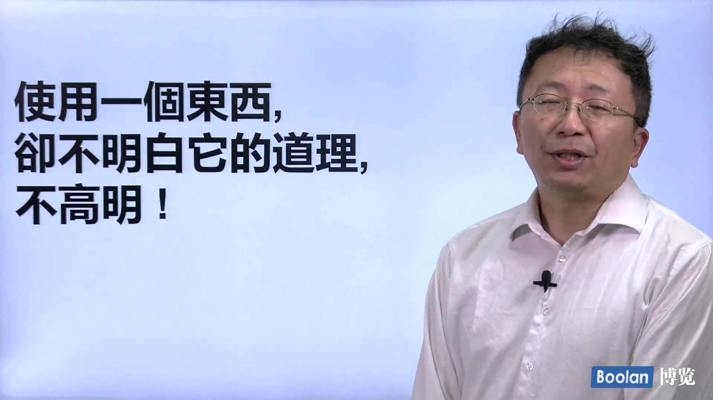

# NeuSoftwareCollegeInformationSecurityCourseMaterials

## 前言

东大软院信安专业19级菜狗一个，留下点课程相关资料，需要自取。此外，留下个我的[邮箱](mailto:goudan.wang@outlook.com)，如果您在阅读时有疑问、发现了错误又或者觉得这个人写的还可以，想交个朋友、又或者想了解我的生涯做一个参考，欢迎联系我。另外再附个[个人网站](http://endgame.cc)，虽然现在没啥内容（或许将来你看到的时候也没有）。。。。

由于选择的课程有限、信息源闭塞，相关的课程资料可能并不丰富，欢迎大家补充

该仓库内容只供参考，还望作业自己写、认真备考。

## 课程简介

以下，是一些课程的简单介绍。文件夹命名方式年级+学期+课程名(e.g. 22_数据结构:大二第二学期数据结构)

### 大二

#### 数论

老师朱潜。一节课有半节课在复习。正常听课的话，能学的不错。期末题主要是平时的题。部分原题，部分改个数据。正经期末考法。

- 推荐资料：图书馆3楼A区有一本大概70页的数论练习题（好像是浙大出版社的）

#### cpp

老师马毅。讲的比较深，但考核比较简单。实验是手动实现string库的几个函数+实现类的继承派生。期末开卷但只能带一张A4纸的笔记。随堂期末。

- 推荐资料：候捷老师的CPP基础+进阶

#### 计网

老师刘益先。40分平时测验和上届题一样。讲的和考的差距有点大（听不听课，考试都不会）正经期末考法。

- 推荐资料：[哈工大慕课](https://www.icourse163.org/course/HIT-154005)

#### 计组

老师程维。期末ppt原题改点数据。比正经期末考的早，但也借教室分开坐。

#### 操作系统

老师王学毅。考题大部分是定义，实验较简单。正经期末考法。操作系统.pdf和操作系统.md内容是相同的，主要为一些概念。可能不太全面，为方便修改提供md版。

#### 数据结构

老师马毅。同样讲的比较深，考的比较简单。期末有手写代码（栈插入、删除指定元素）。动态规划、分治法只考了定义，图相关的题几乎没有。正经期末考法。

#### 数据库

老师王爽。实验较为简单，人均满分。期末题也比较简单（毕竟半学期）SQL为主。正经期末考法。

#### 密码学

老师高天寒。实验较简单。期末题不算难，但题量较大。期中也借教室考。正经期末考法。

#### 密码学实训

老师宋经平。验收会问一些socket通信的问题。实现一些密码学课上的密码，要有界面。2~4人一组。

#### linux实训

老师徐剑。三个小实验：时间服务器、文件备份服务器、借助libpcap抓包。抓包给提供源码，验收先问有界面否。

#### windows程序设计

老师马毅。实验跟着ppt即可。

#### 博弈论

老师刘园。课上有小游戏，结课作业为读论文分享感受。考核较为简单。老师人也很好（期中那天是端午假期前一天，交卷领取鸡蛋+粽子再离场）

#### 数学建模

数学建模选的是理学院的那个课程。（有六七位老师）老师们讲的还不错，两次习题。我21年上的课，第一题是20年国赛C（信贷策略），会给三次修改、扩充机会。第二题是六月份的省赛（第一届）同步，三天单人一队（和校赛同步参加的）、三人一队（已在校赛人员名单里的队伍、不参加校赛的）。

### 大三

#### web

老师杨薇。主讲JS。随堂期末考试主要是JS补全代码+JS运行结果+概念题(HTML+CSS+JS+react+Node.js)，让带电子设备，代码可以直接电脑调试。实验为 Stanford CS142 Web Applications的节选

- 推荐资料：Stanford CS142 Web Applications

#### 深度学习（31的三选一）

老师郑瑛楠。讲的很浅（几乎什么都不讲），一节课4h基本就是2h同学汇报+0.5h知识+0.25h点名+0.25h劝考研。期末考核任意做一个相关项目。

#### 新一代互联网技术

三个老师。借教室期末，曾荣飞老师黑板上写的内容及扩展的内容必考（1~5G分别是什么及区别、华为那两个新技术）。

#### 人工智能导论

老师林川。人很不错，期末复现一篇论文（翻译+代码复现+感受等）。考核期末+期中（开卷考试）+点名

#### 网络攻防技术

老师Ninth。外教讲的很有意思，而且考虑到了我们英语水平不太行，语速会放慢很多能动。会有单独的一节课和每个同学都聊几句话。

#### 软件安全

老师徐剑。知道大家都有自己的生涯规划，上课基本就是只要不影响讲课，你学你的。单元小测+期末考+大作业（都不咋耗时）

#### 实训

32开学还有个实训，大概三个任务：

1. 协议分析嗅探软件（和小学期、网络系统安全的两个都差不太多）+FTP服务器
2. 局域网ARP攻击原理+实现
3. 探索新型攻击方式

#### 大数据挖掘与机器学习

老师曾荣飞。只有三个实验（给代码，不想自己做直接跑70分）

#### 区块链技术

老师王强。课讲的不错，比较负责，但实验是按照步骤复现。很耗时且学不到东西（个人观点）。实验+读论文汇报+期末考+随堂小测+期中。

#### IT职业英语

老师毕佳。事多，但都比较简单，给分尚可。每周会有BB平台答题（无次数限制，取最高分）、还有小组英语的发布会（作业之一）、英文简历、还有一些习题。

#### 企业项目实训

我们这届给的保底公司是：安恒、绿盟、华信。基本分为两个阶段：

1. Web安全相关内容的学习。包括但不限于：各种Web安全方向攻击的原理/复现、入侵检测、渗透测试、应急响应等知识的学习。
2. 华信第二阶段是做一个系统（具体我也不了解）；安恒是渗透测试几个网站、二进制打几个靶场；绿盟和第一阶段类似也是一些课程

总体任务：1阶段结束后会有选择题考试，2阶段也结束后会有实习报告+答辩。

### 大四

#### 软件漏洞分析及挖掘

老师王冬琦。小作业比较多，但简单。实验是南大相关课程Tai-e框架代码补全

- 实验指路：github搜索Tai-e，语言选择Java；会有几份答案。
